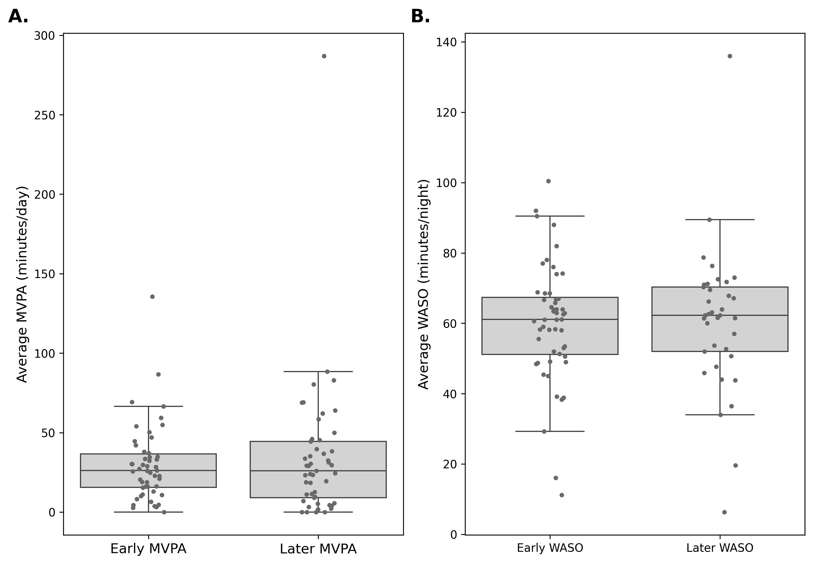
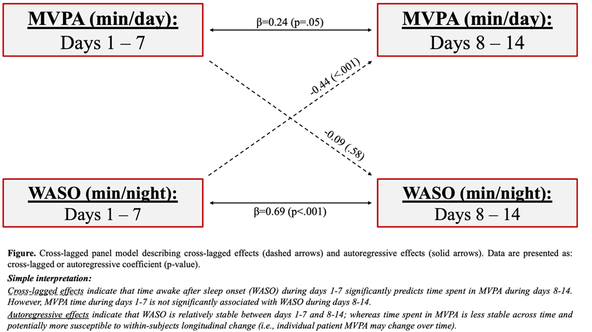

# Summary 

Moseley R, Wingerson MJ, Keeter C, Smulligan KL, Donahue CC, Simon SL, Wilson JC, Howell DR. Longitudinal Associations Between Sleep and Exercise Throughout Recovery from Adolescent Concussion: A Cross-Lagged Panel Model. *In review at... tbd.*

# Abstract:

**Introduction**: Higher volumes of moderate-to-vigorous physical activity (MVPA) and time awake after sleep onset (WASO), a measure of sleep quality, are each associated with faster time to symptom resolution among adolescents with concussion. Bidirectional associations likely exist between exercise and sleep behavior throughout concussion recovery. Our purpose was to understand how sub-acute post-concussion MVPA and WASO directionally affect subsequent MVPA and WASO at timepoints later in recovery.  

**Methods**: We prospectively enrolled adolescents ages 10-18 year old within 21 days of diagnosed concussion in an observational study of post-concussion sleep and physical activity. Participants were provided wrist-worn actigraphy devices at study enrollment and instructed to wear the device continuously to assess exercise and sleep activities for a 14-day monitoring period after enrollment. We recorded min/day spent of MVPA and min/night of WASO. Daily MVPA and WASO were averaged for days 1-7 and 8-14 of the monitoring periods. We used structural equation modeling to develop a cross-lagged panel model. The variables of interest in each time interval included: average MVPA (mins/day) 1-7 days post-concussion, average MVPA (mins/day) 8-14 days post-concussion, average WASO (mins/night) 1-7 days post-concussion, and WASO (mins/night) 8-14 days post-concussion.  

 **Results**: 49 adolescents (15.0±1.6 years old, 55% female) were enrolled 7.6±3.7 days post-concussion and followed for 14 days. Across the entire sample, participants engaged in an average of 29.7±24.9 min/day of MVPA for days 1-7 post-concussion and 33.8±45.3 min/day of MVPA for days 8-14 post-concussion. The average WASO time was 61.1±16.1 min/night for days 1-7 post-concussion and 62.6±19.6 min/night for days 8-14 post-concussion. Cross-lagged coefficients indicated that a one-minute increase in WASO time 1-7 days post-concussion was significantly associated with a 1.39 minute decrease in expected MVPA time 8-14 days post-concussion (p<0.001). The corresponding relationship (MVPA during days 1-7 and WASO during days 8-14) was not statistically significant (p=0.58).  

**Discussion**: Causal predominance, or the extent to which one preceding variable affects a secondary subsequent variable, is estimated in favor of increased WASO early in recovery affecting MVPA later in concussion recovery. Spending more time in bed awake during days 1-7 was associated with reduced volumes of MVPA 8-14 days post-concussion. However, early engagement in MVPA was not associated with substantial changes WASO later in recovery.  

**Significance**: Cross-lagged analyses do not establish cause-effect relationships, but provide evidence as to how variables during one interval of monitoring are associated with variables at a temporally subsequent monitoring interval. Our cross-lagged analysis demonstrates the importance of reducing WASO, a measure of sleep quality, to promote more MVPA later in concussion recovery. Clinicians may consider emphasizing strategies to improve sleep efficiency through individualized interventions.  

**Figure 1.** Box plots representing MVPA and WASO for days 1-7 (early) and days 8-14 (later) of the monitoring period. Individual data points are plotted, along with the median and interquartile range (25th to 75th percentile, shaded box) and 1.5 times the 25th/75th percentile (whiskers).

 
 

**Figure 2.** Cross-lagged model.

